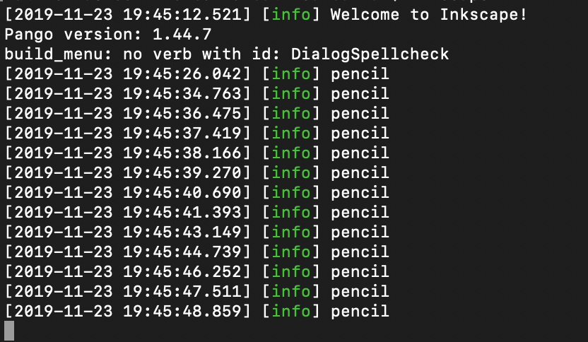

To begin with, this feature only works on MacOS X.

Like it was stated in the project this repository is for the log system that was implemented by our team.

First of all, to be able to run the project locally follow these steps: 

1) Clone the project using the following link: https://github.com/batincanbalkan/betterInkscape.git

2) cd to the file that you just clone and use the following command mkdir build

3) cd build

4) cmake ..

5) make

6) make install

7) type “Inkscape” to launch the app

8) The logs of the files that we specified will be written to the console when that particular tool is used(Please see the image below to be able to understand what to expect if everything goes smoothly when you use the pencil tool).

We have decided to track features like arc-tool, calligraphic-tool, eraser-tool, measure-tool, gradient, pencil-tool, pen-tool, select-tool, spiral-tool, spray-tool, and text-tool. 

If you get errors while following the steps(we got many when we tried to build the project locally) it is because of the missing dependencies. Please install them when you get the errors. An easy way to install is using Homebrew.

To be able to see the integrated parts one must follow the following path: master/src/spdlog. This the program that we used for logging.

Other than that, like stated in the report we have implemented the logging system for some features of Inkscape. You can find these modifications if you follow the following path: master/src/ui/tools. 

To be able to use spdlog we have made modifications to the following file: /master/src/inkscape-main.cpp. 

